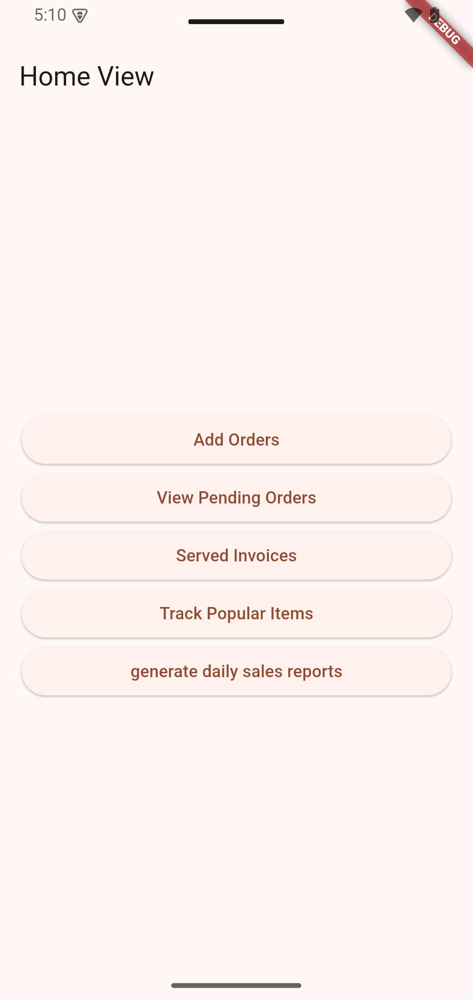
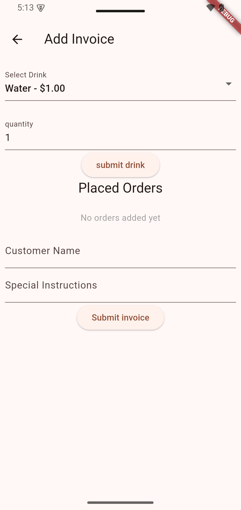
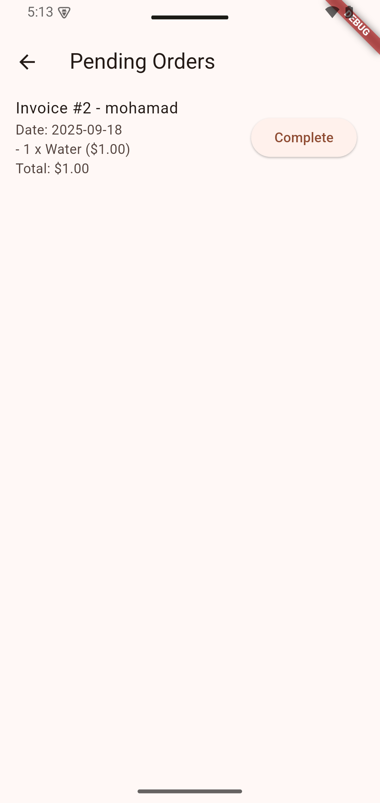
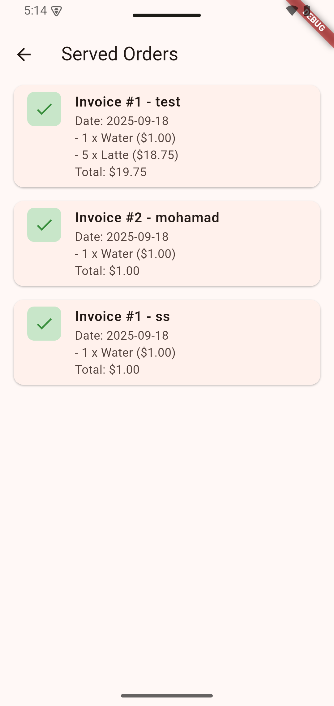
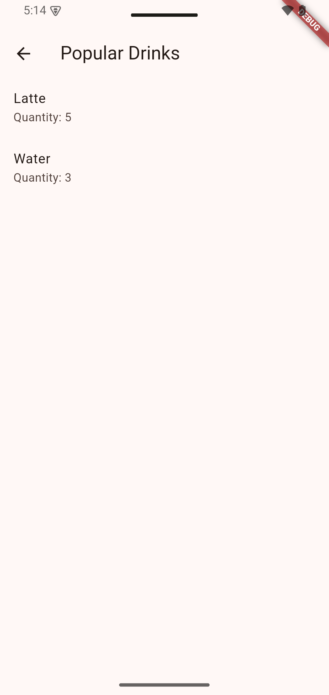
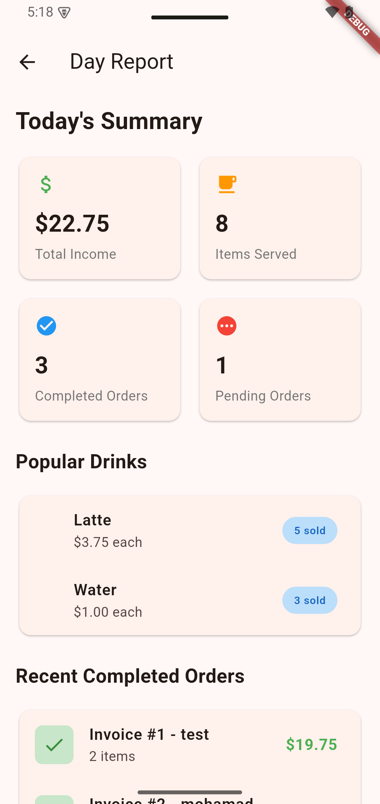
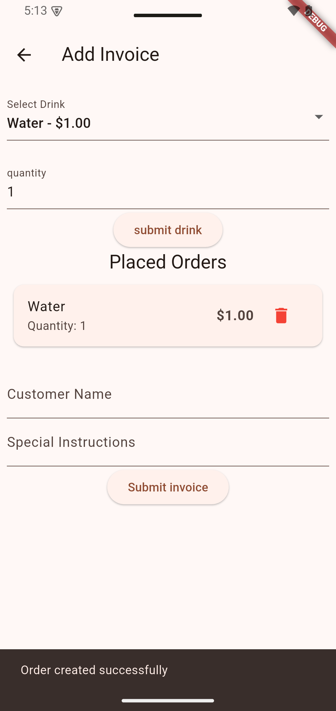

# 🍹 Drinks Invoice Management System

A modern Flutter application for managing drink orders, invoices, and business analytics. Built with clean architecture principles and BLoC state management pattern.

## 📱 Features

### 🏠 Core Functionality
- **Invoice Creation**: Create and manage customer invoices with multiple drink orders
- **Invoice Tracking**: Track pending and completed invoices
- **Business Analytics**: View popular drinks and daily reports

### 🎯 Key Screens
- **Home Dashboard**: Central navigation and quick stats
- **Add Invoice**: Create new invoices with customer details and orders
- **Pending Orders**: View and complete pending invoices
- **Served Orders**: History of completed invoices
- **Popular Drinks**: Analytics showing most ordered drinks
- **Daily Reports**: Comprehensive business insights

## 🏗️ Architecture

### Clean Architecture Implementation
```
lib/
├── features/                 # Feature-based modules
│   ├── add_invoice/         # Invoice creation feature
│   │   ├── logic/           # Business logic (Cubit + States)
│   │   ├── repo/            # Feature-specific repository
│   │   │   ├── interfaces/  # Repository contracts
│   │   │   └── implementations/ # Repository implementations
│   │   └── view/            # UI components and widgets
│   │       └── widgets/     # Feature-specific widgets
│   ├── pending_invoice/     # Pending orders management
│   │   ├── logic/           # Business logic (Cubit + States)
│   │   └── view/            # UI components
│   ├── served_invoices/     # Completed orders history
│   │   ├── logic/           # Business logic (Cubit + States)
│   │   └── view/            # UI components
│   ├── popular_drinks/      # Drink analytics
│   │   ├── logic/           # Business logic (Cubit + States)
│   │   └── view/            # UI components
│   ├── day_report/         # Business reporting
│   │   ├── logic/           # Business logic (Cubit + States)
│   │   └── view/            # UI components
│   └── home/               # Main dashboard
│       ├── logic/           # Business logic (Controllers)
│       └── view/            # UI components
├── data/                    # Data layer
│   ├── models/             # Data models (Invoice, Order, Drink)
│   └── services/           # Data services
├── backend/                # Business logic layer
│   ├── backend_services.dart
│   ├── cache_storage.dart
│   ├── interfaces/         # Backend interfaces
│   └── menu/              # Drink catalog
├── repo/                   # Repository pattern
├── di/                     # Dependency injection
│   ├── service_locator.dart # Main service locator setup
│   └── modules/            # DI modules
│       ├── backend_module.dart # Backend services registration
│       └── ui_module.dart     # UI components registration
└── routing/                # App routing and navigation
    ├── route_generator.dart
    └── routes.dart
```


## 📊 Business Intelligence

### Analytics Dashboard
- **Total Income**: Revenue tracking from all orders
- **Items Served**: Count of all served items
- **Order Status**: Pending vs completed order counts
- **Popular Drinks**: Top-selling drinks with quantities
- **Recent Activity**: Latest completed orders

### Reporting Features
- Daily business summaries
- Popular drink rankings with visual indicators
- Revenue analytics
- Order completion tracking

## 🛠️ Technical Implementation

### State Management Architecture
Each feature has its own dedicated cubit for optimal performance:

```dart
// Feature-specific state management
AddInvoiceCubit      → Invoice creation logic
PendingInvoiceCubit  → Pending orders management
ServedInvoicesCubit  → Completed orders history
PopularDrinksCubit   → Analytics and reporting
DayReportCubit       → Comprehensive business reports
```

### Key Technical Features
- **Dependency Injection**: Using GetIt for service location
- **Repository Pattern**: Clean data access layer
- **Error Handling**: Comprehensive error states and user feedback
- **Form Management**: Reactive forms with validation
- **Navigation**: Route-based navigation with proper cubit provision
- **Memory Management**: Automatic cubit lifecycle management
- **Performance Optimization**: Binary search algorithms for efficient data operations

### ⚡ Performance Optimizations

#### Binary Search Implementation
The application leverages **binary search algorithms** from Dart's `dart:collection` library to optimize critical operations:

```dart
// Efficient invoice lookup during completion
int invoiceIndex = binarySearch(
  storage.pendingInvoices.map((e) => e.id).toList(),
  invoice.id,
);
```

**Performance Benefits:**
- **O(log n) Search Complexity**: Instead of linear O(n) search through pending invoices
- **Scalable Performance**: Maintains fast response times even with large numbers of invoices
- **Memory Efficient**: Uses sorted ID arrays for quick lookups
- **Real-time Operations**: Enables instant invoice status updates without performance degradation

This optimization ensures the application maintains high performance even as the business grows and processes hundreds or thousands of invoices.

## 📱 Screenshots

### 🏠 Home Dashboard







### ⏳ Pending Orders




### ✅ Served Orders




### 📊 Popular Drinks




### 📈 Daily Reports




### 📱 Order Management




## 🚀 Getting Started

### Prerequisites
- Flutter SDK (latest stable version)
- Dart SDK
- Android Studio / VS Code
- Android/iOS emulator or physical device

### Installation
1. **Clone the repository**
   ```bash
   git clone https://github.com/yourusername/drinks-invoice-app.git
   cd drinks-invoice-app
   ```

2. **Install dependencies**
   ```bash
   flutter pub get
   ```

3. **Run the application**
   ```bash
   flutter run
   ```

### Project Setup
The app uses dependency injection for services. All necessary services are automatically configured through the service locator pattern.


## 📦 Dependencies

### Core Dependencies
- `flutter_bloc`: State management
- `get_it`: Dependency injection
- `equatable`: Value equality

## 🔄 Development Workflow

### Architecture Principles
1. **Feature-First**: Each feature is self-contained with its own logic and UI
2. **Single Responsibility**: Each cubit handles one feature's business logic
3. **Clean Separation**: Clear boundaries between UI, business logic, and data
4. **Testability**: All business logic is easily testable
5. **Maintainability**: Modular structure for easy maintenance and updates

### Code Organization
- Features are organized by functionality, not by technical layers
- Each feature contains its complete implementation (logic + UI)
- Shared components and models are in common directories
- Clear separation between business logic and presentation

## 🎯 Completed Features

### ✅ Core Implementation
- [x] **Invoice Management System**: Complete CRUD operations for invoices
- [x] **Order Management**: Add, remove, and modify orders within invoices
- [x] **Customer Management**: Customer information handling
- [x] **Drink Catalog**: Comprehensive drink menu with pricing

### ✅ Business Logic
- [x] **State Management**: Individual cubits for each feature
- [x] **Data Persistence**: In-memory storage with repository pattern
- [x] **Business Rules**: Order calculations, invoice validation
- [x] **Analytics Engine**: Popular drinks calculation and reporting

### ✅ User Interface
- [x] **Responsive Design**: Works on various screen sizes
- [x] **Material Design**: Modern, clean interface
- [x] **Navigation System**: Intuitive app navigation
- [x] **Form Handling**: Comprehensive form validation and user feedback

### ✅ Advanced Features
- [x] **Real-time Updates**: Live data updates across screens
- [x] **Error Handling**: Comprehensive error states and recovery
- [x] **Loading States**: Proper loading indicators
- [x] **Empty States**: Helpful empty state messages
- [x] **Pull-to-Refresh**: Refresh functionality on data screens

## 🔮 Future Enhancements

### 📊 Planned Features
- [ ] **Data Persistence**: SQLite/Hive integration for data storage
- [ ] **Export Functionality**: PDF invoice generation
- [ ] **Advanced Analytics**: Charts and graphs for business insights
- [ ] **User Authentication**: Multi-user support with login system
- [ ] **Offline Support**: Offline-first architecture
- [ ] **Push Notifications**: Order status notifications
- [ ] **Receipt Printing**: Thermal printer integration
- [ ] **Inventory Management**: Stock tracking and alerts

### 🎨 UI/UX Improvements
- [ ] **Dark Mode**: Theme switching support
- [ ] **Animations**: Smooth transitions and micro-interactions
- [ ] **Accessibility**: Screen reader and accessibility improvements
- [ ] **Localization**: Multi-language support
- [ ] **Custom Themes**: Customizable app appearance

### 🔧 Technical Enhancements
- [ ] **Unit Tests**: Comprehensive test coverage
- [ ] **Integration Tests**: End-to-end testing
- [ ] **CI/CD Pipeline**: Automated testing and deployment
- [ ] **Performance Optimization**: App performance monitoring
- [ ] **Code Documentation**: Comprehensive code documentation


## 📞 Contact

For questions, suggestions, or collaboration opportunities:
- **Email**: m011415145@gmail.com
- **LinkedIn**: [Your LinkedIn Profile]([https://linkedin.com/in/yourprofile](https://www.linkedin.com/in/mohamad-hussien-61615737a/))

---

**Built with ❤️ using Flutter**

